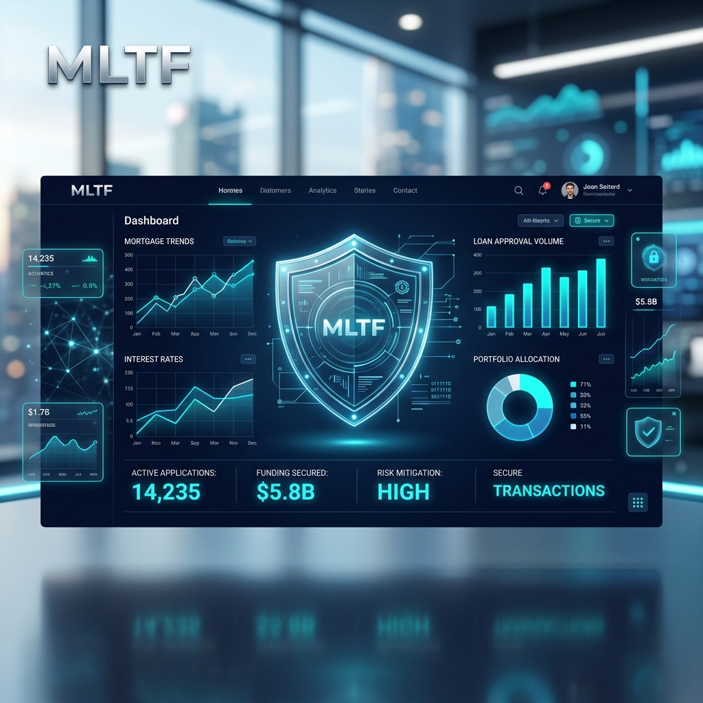
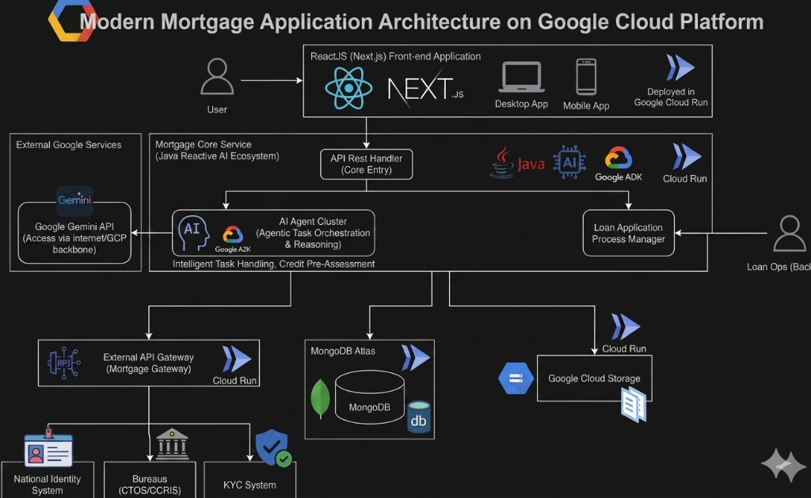

# 🚀 MLTF: Mortgage Loan for the Future

### *Advancing Malaysia’s Digital Sovereignty through Secure AI-Native FinTech*

> [!IMPORTANT]
> ### 🏆 Hackathon Submission Details
> *   **Track 5:** Secure Digital (FinTech & Security)
> *   **Live Demo:** [👉 **Launch MLTF on Google Cloud Run**](https://mortgage-ui-644495514226.us-central1.run.app) (Mandatory Deployment)
> *   **Pitch Deck:** [📊 **View Presentation (Canva Slides)**](https://canva.link/1v7ta1x2z71l7f0)

-----

## 🎯 1. Problem Clarity & National Relevance

**The "Million-Ringgit" Challenge:**
Digital fraud and sophisticated scams result in millions of ringgit in losses for Malaysian citizens annually. Traditional mortgage processes in Malaysia are still hampered by manual document verification—a significant bottleneck that MLTF aims to eliminate.

**Our Solution:**
MLTF transitions from being a "technology consumer" to a **"Sovereign Technology Builder"** by engineering an indigenous digital infrastructure for secure lending. We solve bureaucratic friction by automating high-fidelity mortgage approvals while outpacing automated threats through real-time AI forensic layers.

-----

## 🏗️ 2. AI Implementation & Technical Execution

MLTF strictly adheres to the **"Build with AI" mandate**, moving beyond simple chat interfaces to **Agentic AI**—autonomous systems capable of reasoning and executing multi-step tasks.

### **The AI Stack (The Brain & Orchestrator)**

  * **Gemini 1.5 Flash:** Powers our low-latency, real-time AI Application Review.
  * **Vertex AI Agent Builder:** Orchestrates our **6-Agent Cluster** for multi-step reasoning (Forensics, e-KYC, Credit Analysis).
  * **OpenCV.js Web Workers:** Performs **On-Device Computer Vision** for perspective correction and privacy-first scanning before data touches the cloud.

### **System Architecture Diagram**



### **Architecture Breakdown**

*   **Frontend (Next.js 15):** The user-facing application built on Next.js 15, optimized for speed and security. It leverages **OpenCV.js Web Workers** for on-device computer vision (privacy-first document scanning) and implements **Zero-Knowledge Password Architecture** to keep plain-text credentials local.
*   **Backend (Agentic AI Core):** A robust **Java Reactive** engine that serves as the "brain." It orchestrates a **6-Agent Cluster** powered by **Gemini 1.5 Flash** and **Vertex AI**, enabling autonomous reasoning for forensic document verification, e-KYC, and real-time credit underwriting.
*   **External API Gateway (Mortgage Gateway):** A specialized microservice that handles secure communications with national infrastructure, including the **National Identity System**, **Credit Bureaus (CTOS/CCRIS)** and third-party **KYC Systems**.
*   **Data Layer (MongoDB Atlas):** A high-performance, cloud-native document database used for secure, encrypted storage of mortgage applications, forensic audit logs, and agentic reasoning metadata.

-----

## 🧪 3. Judge's Quick-Start Guide

MLTF is fully containerized and deployed on **Google Cloud Run**, meeting the mandatory technical requirement.

### **Step 0: Pre-requisites & Testing Assets**

Before starting the evaluation, please prepare the following:
*   **Test Account:** Login with `email: bagusmwicaksono@gmail.com` | `password: 123123` (or register a new account).
*   **Test Documents:** Download the sample documents from this [Google Drive Folder](https://drive.google.com/drive/folders/1beHOBZUpZuvnP_jWAJUzVPoJi0326v3P?usp=drive_link).
*   **Demo Video:** Watch the [Full Walkthrough Video](https://drive.google.com/file/d/1YTP8-Yzs5SU9gaLBdZMs1taB8D3pICNN/view?usp=drive_link) for guidance.

### **Step 1: Secure Identity & Privacy**

*   **Action:** Log in via our **Zero-Knowledge Password Architecture**.
*   **Innovation:** We implement client-side SHA-256 hashing. Your plain-text password never touches the network—aligning with Malaysia's need for secure financial ecosystems.

### **Step 2: Real-Time e-KYC & Verification**

*   **Action:** Capture your NRIC/ID and selfie (Mobile browser recommended).
*   **Observation:** Notice the **OpenCV.js engine** performing perspective correction locally to ensure document integrity before the **AI Forensic Agent** scans for pixel-level tampering.

### **Step 3: Agentic AI Underwriting**

*   **Action:** Upload the financial documents (Salary slips, Tax forms).
*   **Observation:** Watch the **Server-Sent Events (SSE)** stream. This is a real-time window into the AI reasoning process as it validates data integrity and performs AML/Sanctions screening.

### **Step 4: Backend Ops Review**

*   **Action:** Access the [Loan Ops Backend](https://mortgage-ui-644495514226.us-central1.run.app/backend) to review submitted applications.
*   **Observation:** Examine the forensic analysis and credit pre-assessment generated by the **Vertex AI Agent Cluster**.

-----

## 💻 4. Local Development & Code Quality

MLTF is built using a decoupled microservices architecture. For detailed setup instructions, please refer to the `README.md` in each respective repository:

1.  **[Mortgage UI](https://github.com/mortgage-loan-for-the-future/mortgage-ui)**: Next.js 15 frontend with OpenCV.js integration.
2.  **[Mortgage Service](https://github.com/mortgage-loan-for-the-future/mortgage-service)**: Java Reactive core engine and Vertex AI Agent Cluster.
3.  **[Mortgage Gateway](https://github.com/mortgage-loan-for-the-future/mortgage-gateway)**: External API bridge for national identity and credit bureau integration.

**Quick Clone:**
```bash
# Clone the entire ecosystem
git clone https://github.com/mortgage-loan-for-the-future/mortgage-ui.git
git clone https://github.com/mortgage-loan-for-the-future/mortgage-service.git
git clone https://github.com/mortgage-loan-for-the-future/mortgage-gateway.git
```

-----

## 🏆 5. Impact & Future Potential

  * **Efficiency:** Compresses the mortgage decision cycle from **weeks to minutes**.
  * **Security:** Multi-layer protection (Biometric Liveness + Forensic AI) to stop forged documents from bypassing legacy OCR systems.
  * **Scalability:** Built on a decoupled microservices architecture ready for national-scale deployment on Google Cloud.

-----

### **Mandatory Disclosures**

  * **AI Usage:** This project utilized Gemini for code optimization and Firebase Genkit for agentic workflow orchestration.
  * **Deployment:** Deployed on **Google Cloud Run** at: `https://mortgage-ui-644495514226.us-central1.run.app`.

**Developed for Project 2030: MyAI Future Hackathon.** *Advancing the Nation, Building Solutions with Google AI.*
